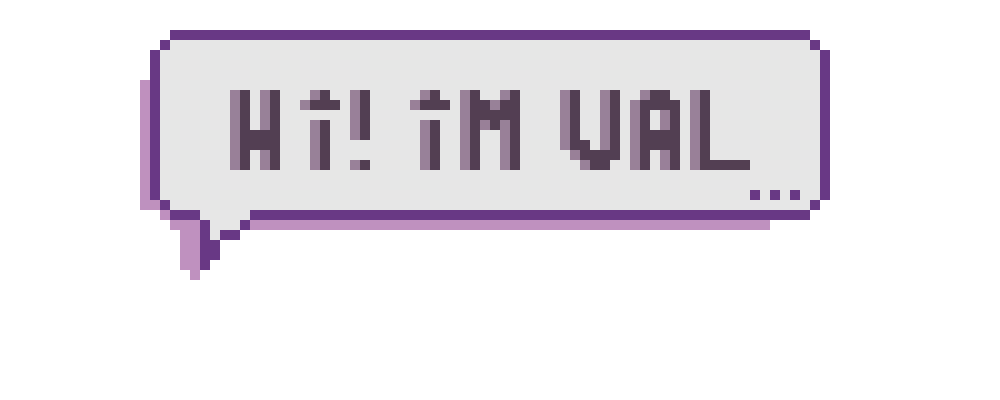

<!-- Banner -->

  
  
  <!-- Typing Animation -->
  

 

## 👩‍💻 About Me
🎓 Studying **Computer Engineering** at *Universidad de La Laguna*  
💡 Passionate about **Software Development** and **Cybersecurity**  
🎨 Creating **Art** in my free time  
🚀 Always learning and exploring new technologies

 

## 🛠️ Technologies & Tools

 

## 📊 GitHub Stats

<!-- Main Stats -->

<!-- Top Languages -->

  

 

## 🐍 Contribution Snake

  <picture>
    <source media="(prefers-color-scheme: dark)" srcset="https://raw.githubusercontent.com/ValBoschP/ValBoschP/output/github-contribution-grid-snake-dark.svg">
    <source media="(prefers-color-scheme: light)" srcset="https://raw.githubusercontent.com/ValBoschP/ValBoschP/output/github-contribution-grid-snake.svg">
    
  </picture>

 

## 🌐 Connect With Me

  

---

  

